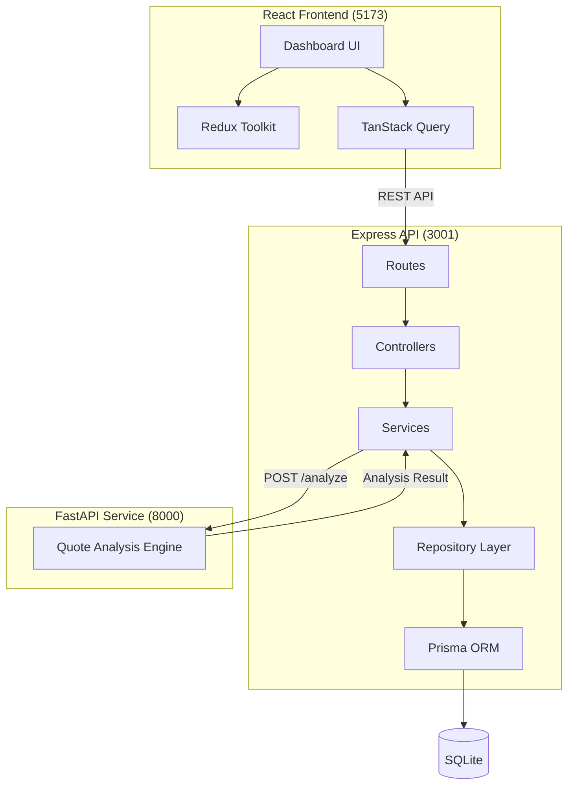

# Quote Request Workflow Dashboard

A full-stack application for managing and analyzing customer quotes. This project consists of three main components: a React frontend, an Express (Node.js) orchestrator, and a FastAPI (Python) analysis service.

## Architecture



- **Frontend (`client/`)**: React + Vite, Tailwind CSS v4, Redux Toolkit for UI state, and TanStack Query for server state and caching.
- **Backend API (`server/`)**: Express with TypeScript, Prisma ORM, and SQLite. Acts as the primary orchestrator and database interface.
- **Analysis Service (`fastapi-server/`)**: A stateless FastAPI Python service that performs a rule-based analysis on quotes based on project keywords and estimated values.

## Features

- **Quote Management**: Create and view customer quotes.
- **Dashboard Interface**: Clean, business-friendly split-view design with summary metrics.
- **State Management**: Search and filter quotes instantly using Redux.
- **AI Risk Analysis**: Trigger a rule-based analysis through an isolated FastAPI microservice that evaluates risk and identifies missing project information.
- **Validation**: Zod schema validation on the backend ensures data integrity.
- **End-to-End Type Safety**: TypeScript is used extensively across the React client and Express server.

## Prerequisites

- Node.js (v18+)
- pnpm
- Python 3.10+

## Quick Start

This project requires running three separate processes. Open three terminal windows:

### 1. Start the FastAPI Service
```bash
cd fastapi-server
python3 -m venv .venv
source .venv/bin/activate
pip install -r requirements.txt
uvicorn main:app --port 8000
```

### 2. Start the Express Backend
```bash
cd server
pnpm install
# Initialize the SQLite database and seed initial data
pnpm prisma db push
pnpm seed
# Start the dev server
pnpm dev
```
*The Express server will run on `http://localhost:3001`.*

### 3. Start the React Frontend
```bash
cd client
pnpm install
pnpm dev
```
*The frontend will run on `http://localhost:5173`. It automatically proxies API requests to the Express server.*

## Design Decisions & Architecture Notes

### Why a separate Express and FastAPI server?
The Express server acts as the central orchestrator and data persistence layer (interacting with SQLite via Prisma). It provides a robust, typed API for the frontend. The FastAPI service is entirely stateless and dedicated purely to computation (risk analysis). This separation of concerns allows the computation layer to scale independently and leverages Python's strengths for data processing, while keeping the main web server in Node.js.

### State Management
- **Redux Toolkit** is used strictly for synchronous UI state (the active search query, selected dropdown filters, and the currently selected quote ID).
- **TanStack Query** handles all asynchronous server state (fetching the quote list, running mutations, caching, and loading/error states). This prevents Redux from becoming bloated with boilerplate API code.

### SQLite Constraints
SQLite lacks native support for arrays. To store the `missingItems` array returned by the FastAPI service, the Express repository layer automatically serializes and deserializes the array to/from a JSON string before database insertion and upon retrieval.
